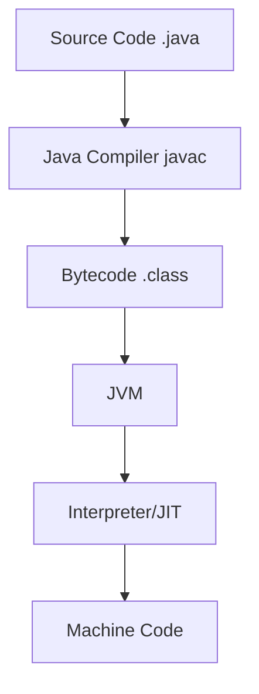
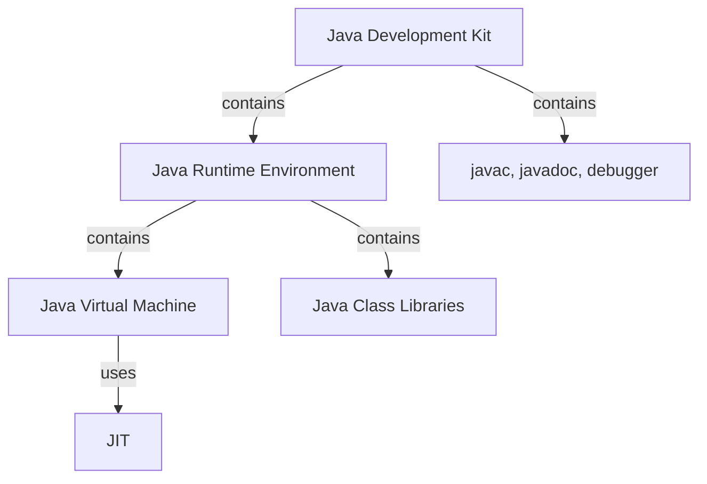

# Java Programming: Comprehensive Guide

## Table of Contents

1. [Introduction to Java](#introduction-to-java)
2. [Java Execution Process](#java-execution-process)
3. [Platform Independence](#platform-independence)
4. [JDK vs JRE vs JVM](#jdk-vs-jre-vs-jvm)
5. [JVM Architecture](#jvm-architecture)
6. [Java Basic Syntax](#java-basic-syntax)
7. [Java Data Types](#java-data-types)
8. [Variables and Operators](#variables-and-operators)
9. [Control Flow Statements](#control-flow-statements)
10. [Object-Oriented Programming in Java](#object-oriented-programming-in-java)
11. [Exception Handling](#exception-handling)
12. [Java Memory Management](#java-memory-management)

---

## Introduction to Java

**Java** is a high-level, object-oriented programming language developed by Sun Microsystems (now owned by Oracle) in 1995. It follows the "Write Once, Run Anywhere" (WORA) principle.

### Key Features:

- **Platform Independent**: Bytecode runs on any system with JVM
- **Object-Oriented**: Follows OOP principles (encapsulation, inheritance, polymorphism)
- **Robust**: Strong memory management, exception handling
- **Secure**: Built-in security features (no pointers, bytecode verification)
- **Multithreaded**: Supports concurrent programming
- **Distributed**: Network-centric programming capabilities

### Java Editions:

1. **Java SE (Standard Edition)**: Core Java platform
2. **Java EE (Enterprise Edition)**: For enterprise applications
3. **Java ME (Micro Edition)**: For mobile and embedded systems

---

## Java Execution Process



1. **Writing**: Create `.java` file with Java syntax
2. **Compilation**: `javac` converts source code to bytecode (`.class` file)
3. **Loading**: Class loader loads bytecode into JVM
4. **Verification**: Bytecode verifier checks code validity
5. **Execution**:
   - Interpreter executes bytecode line by line
   - JIT compiler optimizes frequently used code
6. **Runtime**: Hardware executes native machine code

---

## Platform Independence


### How Java Achieves Platform Independence:

1. **Bytecode Generation**: Intermediate representation between source and machine code
2. **JVM Implementation**: Each platform has its own JVM implementation
3. **Abstraction Layer**: JVM handles platform-specific operations

### Comparison with Compiled Languages:

| Aspect         | Java                    | C/C++                  |
| -------------- | ----------------------- | ---------------------- |
| Compilation    | To bytecode             | To machine code        |
| Execution      | JVM interprets bytecode | Direct CPU execution   |
| Portability    | High (WORA)             | Requires recompilation |
| Performance    | Slightly slower         | Faster                 |
| File Extension | .java → .class          | .c/.cpp → .exe/.o      |

---

## JDK vs JRE vs JVM



### Detailed Comparison:

| Component | Purpose          | Contains                         | Needed For                   |
| --------- | ---------------- | -------------------------------- | ---------------------------- |
| **JDK**   | Development      | JRE + Tools (compiler, debugger) | Developing Java applications |
| **JRE**   | Execution        | JVM + Libraries                  | Running Java applications    |
| **JVM**   | Execution Engine | Interpreter, JIT, GC             | Bytecode execution           |
| **JIT**   | Performance      | Hotspot compiler                 | Optimizing frequent code     |

---

## JVM Architecture


### Components:

1. **Class Loader Subsystem**:
   - Loading: Reads .class files
   - Linking: Verification, preparation, resolution
   - Initialization: Static variables and blocks

2. **Runtime Data Areas**:
   - Method Area: Class metadata
   - Heap: Object storage
   - Stack: Method calls and local variables
   - PC Registers: Thread execution pointers
   - Native Method Stack: Native code support

3. **Execution Engine**:
   - Interpreter: Line-by-line execution
   - JIT Compiler: Optimizes hot code
   - Garbage Collector: Automatic memory management

4. **Native Method Interface (JNI)**: Interface with native libraries
5. **Native Libraries**: OS-specific functionality

---

## Java Basic Syntax

### Simple Java Program Structure:

```java
// Class declaration
public class HelloWorld {

    // Main method - program entry point
    public static void main(String[] args) {

        // Statement
        System.out.println("Hello, World!");
    }
}
```

### Key Syntax Elements:

1. **Case Sensitivity**: `MyClass` ≠ `myclass`
2. **Class Names**: PascalCase, should match filename
3. **Method Names**: camelCase
4. **main() Method**: Mandatory entry point
5. **Package Declaration**: Optional, must be first line
6. **Import Statements**: After package, before class
7. **Statements**: End with semicolon (;)

---

## Java Data Types

### Primitive Data Types:

| Type    | Size    | Range               | Default  | Example                  |
| ------- | ------- | ------------------- | -------- | ------------------------ |
| byte    | 1 byte  | -128 to 127         | 0        | `byte b = 100;`          |
| short   | 2 bytes | -32,768 to 32,767   | 0        | `short s = 5000;`        |
| int     | 4 bytes | -2³¹ to 2³¹-1       | 0        | `int i = 100000;`        |
| long    | 8 bytes | -2⁶³ to 2⁶³-1       | 0L       | `long l = 15000000000L;` |
| float   | 4 bytes | ~6-7 decimal digits | 0.0f     | `float f = 5.75f;`       |
| double  | 8 bytes | ~15 decimal digits  | 0.0d     | `double d = 19.99;`      |
| char    | 2 bytes | Unicode characters  | '\u0000' | `char c = 'A';`          |
| boolean | 1 bit   | true/false          | false    | `boolean flag = true;`   |

### Reference Data Types:

- Objects
- Arrays
- Strings
- Interfaces

---

## Variables and Operators

### Variable Declaration:

```java
type variableName = value;
// Example:
int age = 25;
String name = "John";
```

### Types of Variables:

1. **Local Variables**: Declared in methods/blocks
2. **Instance Variables**: Non-static fields in classes
3. **Static Variables**: Class-level variables

### Operators:

| Category   | Operators                |
| ---------- | ------------------------ |
| Arithmetic | +, -, \*, /, %, ++, --   |
| Assignment | =, +=, -=, \*=, /=       |
| Comparison | ==, !=, >, <, >=, <=     |
| Logical    | &&, \|\|, !              |
| Bitwise    | &, \|, ^, ~, <<, >>, >>> |

---

## Control Flow Statements

### Decision Making:

```java
// if-else
if (condition) {
    // code
} else if (condition) {
    // code
} else {
    // code
}

// switch-case
switch (expression) {
    case value1:
        // code
        break;
    default:
        // code
}
```

### Looping:

```java
// for loop
for (initialization; condition; update) {
    // code
}

// while loop
while (condition) {
    // code
}

// do-while
do {
    // code
} while (condition);
```

### Jump Statements:

- `break`: Exit loop/switch
- `continue`: Skip current iteration
- `return`: Exit method

---

## Object-Oriented Programming in Java

### Four Pillars of OOP:

1. **Encapsulation**: Bundling data with methods
2. **Inheritance**: IS-A relationship
3. **Polymorphism**: Many forms (method overriding/overloading)
4. **Abstraction**: Hiding implementation details

### Class and Object:

```java
// Class definition
public class Dog {
    // Field
    String breed;

    // Method
    void bark() {
        System.out.println("Woof!");
    }
}

// Object creation
Dog myDog = new Dog();
myDog.breed = "Labrador";
myDog.bark();
```

### Inheritance Example:

```java
class Animal {
    void eat() {
        System.out.println("Eating...");
    }
}

class Dog extends Animal {
    void bark() {
        System.out.println("Barking...");
    }
}
```

---

## Exception Handling

### Try-Catch Block:

```java
try {
    // risky code
} catch (ExceptionType e) {
    // handle exception
} finally {
    // always executes
}
```

### Common Exceptions:

- `NullPointerException`
- `ArrayIndexOutOfBoundsException`
- `IOException`
- `NumberFormatException`

### Custom Exception:

```java
class MyException extends Exception {
    public MyException(String message) {
        super(message);
    }
}
```

---

## Java Memory Management

### Memory Areas:

1. **Heap**: Objects, instance variables
2. **Stack**: Methods, local variables
3. **Method Area**: Class metadata, static variables

### Garbage Collection:

- Automatic memory reclamation
- Runs on heap memory
- Types of GC:
  - Serial GC
  - Parallel GC
  - CMS GC
  - G1 GC

### Memory Management Tips:

- Use local variables when possible
- Nullify references when done
- Avoid memory leaks
- Use weak references for caches

---
